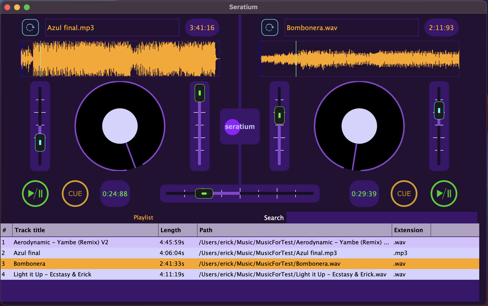

# Seratium

Seratium is a DJ application capable of reading .mp3 and .wav files, with DJ controllers allowing tempo and volume manipulation. The user also has access to a playlist that let's add music to the desks.

<br>



# Install Seratium IOS

Download and install the [Seratium Package](https://github.com/egmp7/Seratium/releases/download/music/Seratium.pkg).

# Source Files Hierarchy 

1. Assets (png images)
2. Source
    1. Utilities
        1. CSV.h
        2. Format.h
    2. Models
        1. TrackEntry.h
    3. Controllers
        1. DJAudioPlayer.h
    4. Components
        1. DeckComponents
            1. WaveformDisplay.h
            2. DeckAnimation.
            3. Volume.h
            4. Speed.h
            5. CurrentTime.h
            6. RemainingTime.h
            7. CueButton.h
            8. LoadButton.h
            9. PlayPauseButton.h
            10. TrackName.h
        2. Playlist.h
        3. Crossfader.h
    5. GUIs
        1. MainGUI.h
        2. DeckGUI.h
        3. FaderLookAndFeel.h
    6. Main.cpp
    7. MainComponent.h


# Application functionality

## Load a file

There are three options to load a file:

1. By clicking the load button and picking up a file from the pop-up menu
2. Drag and drop a file from a main window
3. Drag and drop a file from the playlist

Each option invokes the controller DJAudioPlayer load method that receives a URL argument. This method creates the reader source for the AudioTransportSource class which allows controlling the audio. 

```
void DJAudioPlayer::loadURL(URL audioURL)
{
    // Audio Format Reader
    auto * reader = formatManager.createReaderFor(
        audioURL.createInputStream(
            URL::InputStreamOptions (URL::ParameterHandling::inAddress)
                .withConnectionTimeoutMs (1000)
                .withNumRedirectsToFollow (0)));
    
    if (reader != nullptr) // good file
    
    {
        // Audio Format Reader Source
        std::unique_ptr<juce::AudioFormatReaderSource> newSource (new AudioFormatReaderSource (reader,true));
    
        // Transport Source
        transportSource.setSource(newSource.get(),0,nullptr,reader->sampleRate);
        
        readerSource.reset(newSource.release());
    }
}
```
## Two track playback

The MainComponent.h creates an instance of the MixerAudioSource Class which receives one or more Audio Sources pointers and mix them together. This happens during the audio life cycle specified by the JUCE framework.

```
void MainComponent::prepareToPlay (int samplesPerBlockExpected, double sampleRate)
{
    // delegate to DJAudioPlayer
    player1.prepareToPlay(samplesPerBlockExpected, sampleRate);
    player2.prepareToPlay(samplesPerBlockExpected, sampleRate);
    
    // plug sources into the mixer
    mixerSource.addInputSource(&player1, false);
    mixerSource.addInputSource(&player2, false);

}

void MainComponent::getNextAudioBlock (const juce::AudioSourceChannelInfo& bufferToFill)
{
    mixerSource.getNextAudioBlock(bufferToFill);
}

void MainComponent::releaseResources()
{
    player1.releaseResources();
    player2.releaseResources();
    mixerSource.releaseResources();
}
```
## Volume Component

The crossfader component sets the gain property of the AudioTransportSource and it is affected by the Volume class in each deck. The crossfader component will be explained in more detail in its section. The Volume component listens to the slider changes and sets the  VolumeL and VolumeR properties of the Crossfader class. Finally, the crossfader makes the calculations to set the gain of the AudioTransportSource.

```
void Volume::sliderValueChanged(Slider* slider)
{
    if(getComponentID() == "volLeft")
        crossfader->setVolumeL(slider->getValue());
    if(getComponentID() == "volRight")
        crossfader->setVolumeR(slider->getValue());
}
```

## Speed Component

Each Deck has access to an instance of the controller DJAudioPlayer respectively, allowing communication between these two classes. The ResamplingAudioSource is instantiated in DJAudioPlayer and possesses
the ResamplingRatio property that varies the speed of the track. The Speed component sets the ResamplingRatio between 0.5 and 1.5 with a slider listener. Similar to the MixerAudioSource, the resamplingAudioSource uses the audio life cycle to send the output information.

```
void Speed::sliderValueChanged(Slider* slider)
{
    player->setSpeed(slider->getValue());
}

void DJAudioPlayer::setSpeed(double ratio)
{
    if(ratio < 0 || ratio > 100.0)
    {
        cout << "DJAudioPlayer::setSpeed setSpeed should be between 0 and 100.0"<< endl;
    }
    else
    {
        resampleSource.setResamplingRatio(ratio);
    }
}
```